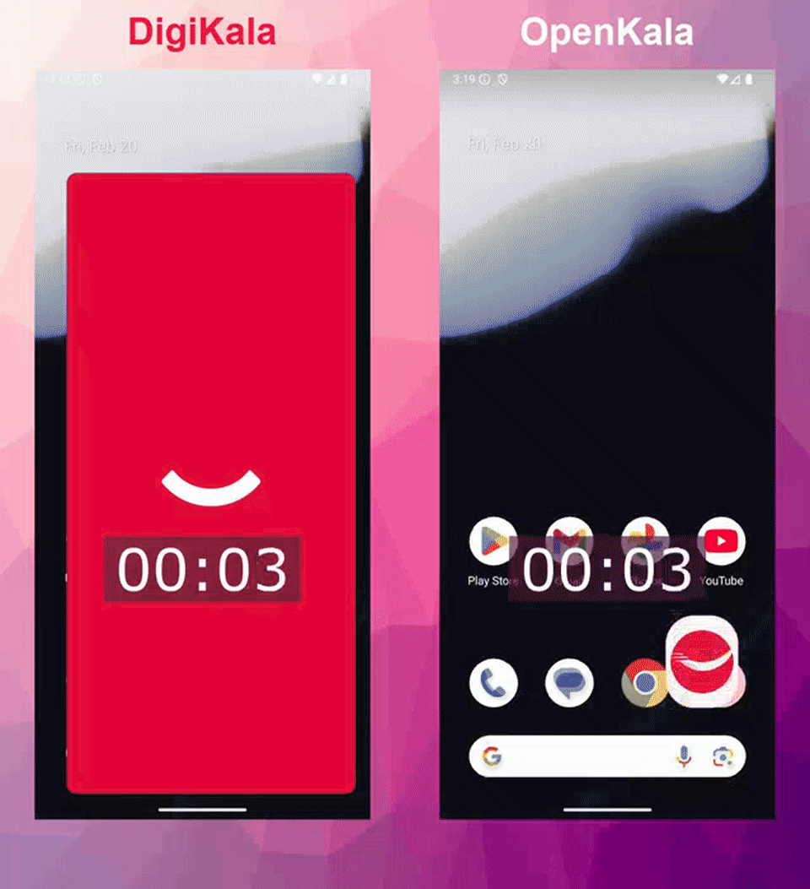
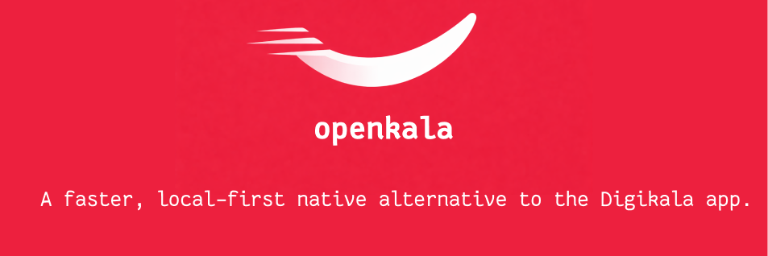

# OpenKala





A native Android Digikala client focused on speed, smoothness, and cache-first UX.

This project was fully vibecoded using Codex GPT-5.3.


## Install (APK)

Download the latest APK from the [GitHub Releases](https://github.com/mohammadamin16/openkala/releases/latest) page.

- Open the release
- Download the apk file.
- Install on your Android device.

## Project Summary

- Native Android app (Jetpack Compose + Kotlin), not React Native.
- Cache-first data flow for faster startup and reduced loading waits.
- Pixel-focused RTL UI implementation based on Digikala screens.
- Shared-element transitions for key flows (home/search and item/detail experiences).
- API-driven home, search, category, and product detail sections using Digikala public endpoints.
- Performance-first approach: stable list keys, incremental refresh, and minimized recomposition hotspots.

## Current Scope

- Home screen with multiple dynamic sections (including incredible offers and banners).
- Product detail screen with variant/color handling and live countdowns.
- Search entry and search results flow.
- Category browsing flow.

## Tech Stack

- Kotlin
- Jetpack Compose
- Hilt (DI)
- Retrofit + Kotlinx Serialization
- DataStore (local cache)
- Coil (image loading)

## Run Locally

```bash
./gradlew :app:assembleDebug
```


## Contact

- Email: toutounchi.ma@gmail.com
